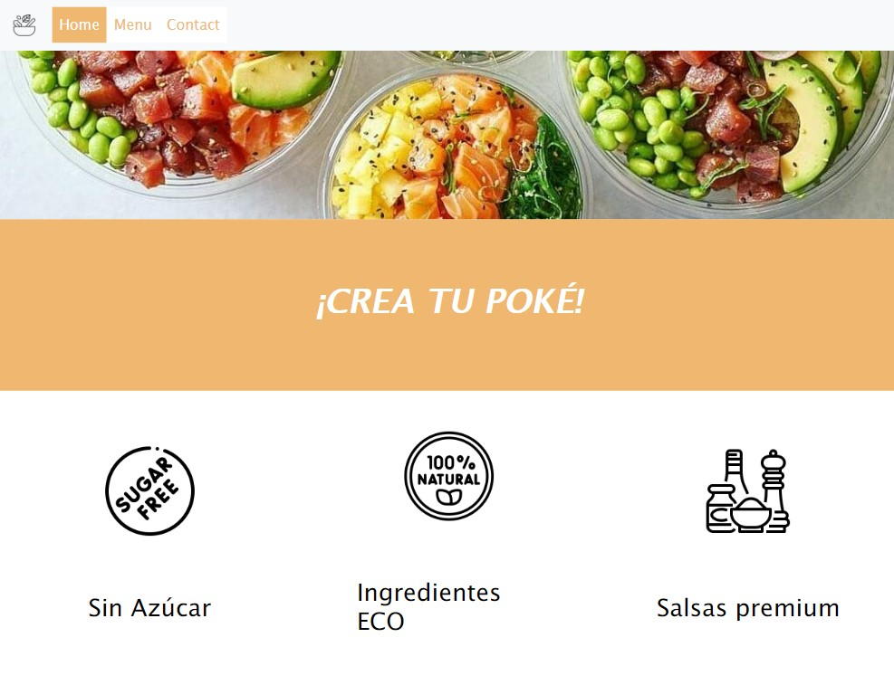
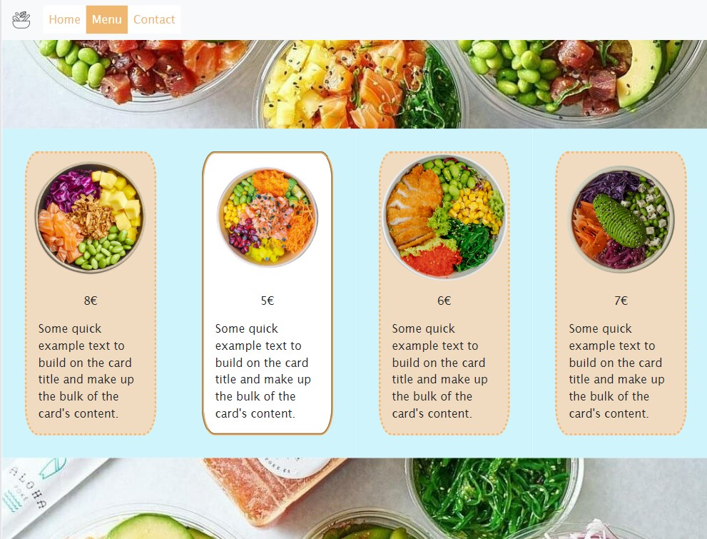
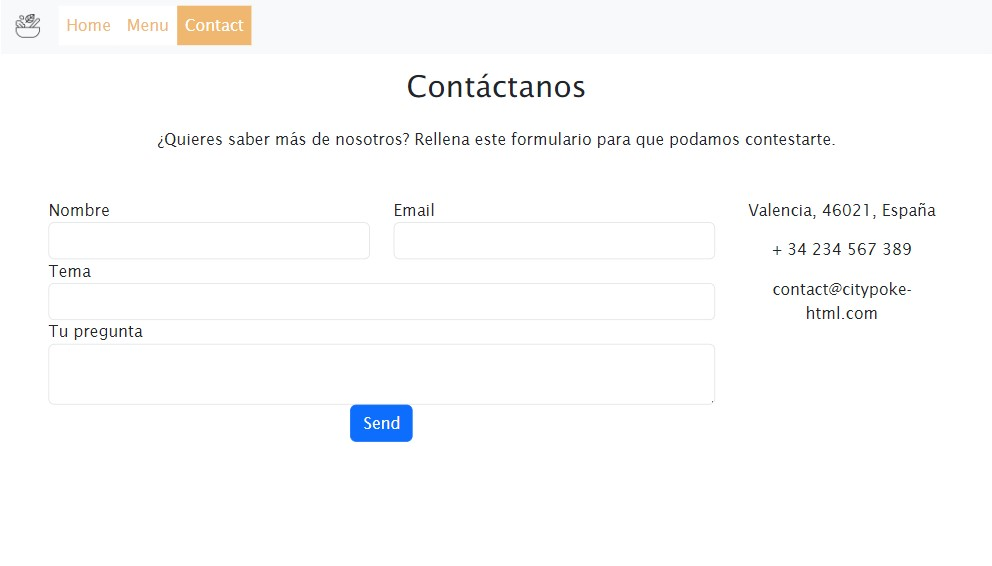

# Wellcome to my first frontend app about City Poké 🖋️

## City Poke is an app designed with HTML, Css and Boostrap 📝


  <ol>
    <li><a href="#objective 🎯">Objective</a></li>
    <li><a href="#about the project 🔎">About the project</a></li>
    <li><a href="#deploy-🚀">Deploy</a></li>
    <li><a href="#stack">Stack</a></li>
    <li><a href="#on-site installation🔧">Installation</a></li>
    <li><a href="#tabs📎">Tabs</a></li>
    <li><a href="#futuras-funcionalidades">Futuras funcionalidades</a></li>
    <li><a href="#contribuciones">Contribuciones</a></li>
    <li><a href="#licencia">Licencia</a></li>
    <li><a href="#webgrafia">Webgrafia</a></li>
    <li><a href="#desarrollo💡">Desarrollo</a></li>
    <li><a href="#agradecimientos">Agradecimientos</a></li>
    <li><a href="#contacto">Contacto</a></li>
  </ol>
</details>

## Objective 🎯

<p>The main purpose of the project is to make a responsive website. It should shows the company City Poké with clean and minimal layout ✨</p>

## About the project 🔎

<p>I chosed the City Poké company because I consider their food is cheap and is a good alternative for young people who want a healthy lifestyle 🤸🌱

## Deploy 🚀

<div align="center">
    <a href="https://marinaescriva.github.io/restaurante/">🥑<strong> City Poké</strong>🥑</a>
</div>

## Stack🛠️

 * HTML5
 * CSS3
 * Boostrap

## On-site installation

1. Clone the reposit
2. ` $ npm install `
3. ``` $ npm run dev ```
4. ...

## Tabs 👁

#### Home


#### Menu


#### Contact


